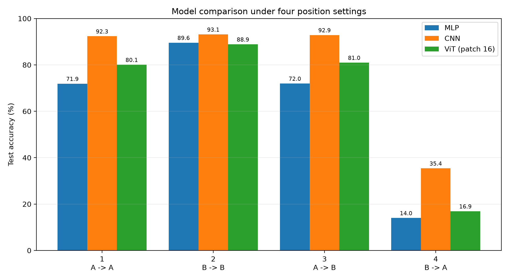
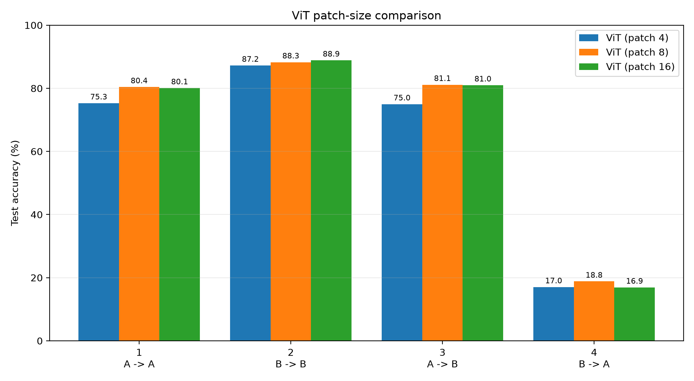
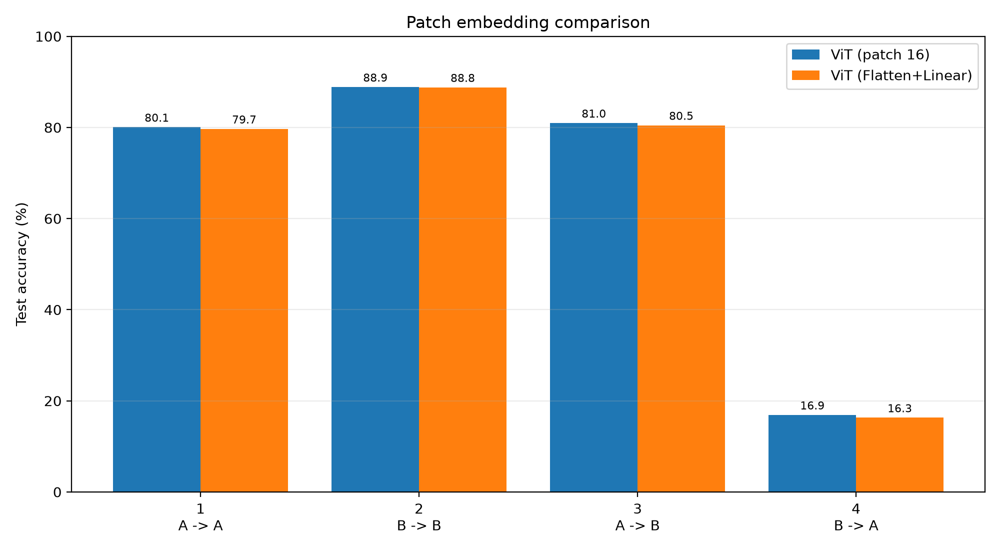
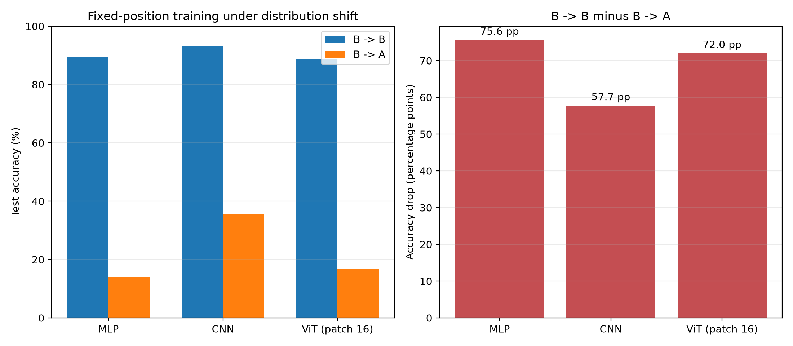
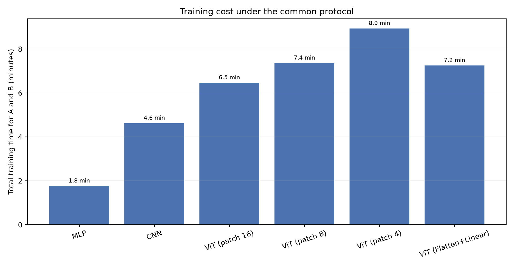
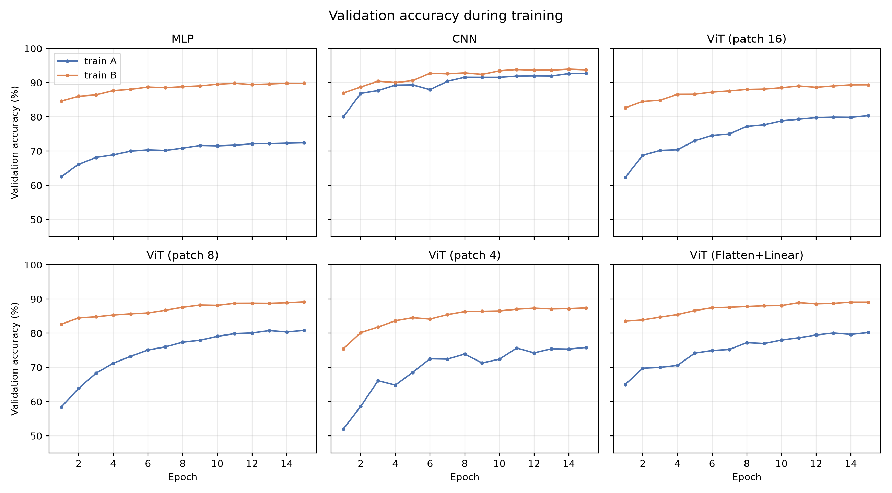
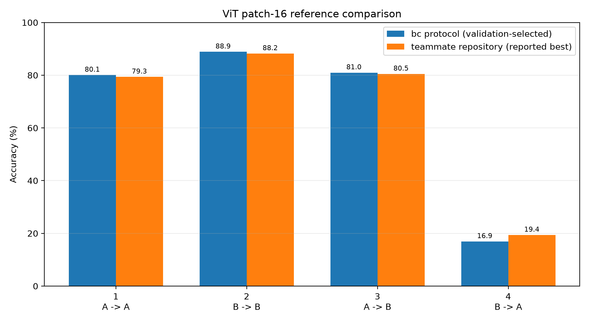

# 三组对比实验

本目录对应课程作业中的“其他尝试”。基础任务仍是位置可变 FashionMNIST
分类；这里不改动同学仓库代码，而是在统一的数据划分和评价协议下补充三组实验。

## 对比内容

### 1. MLP、CNN 与 ViT

三种模型接收相同的 `64×64` 灰度图像，使用同一训练集、验证集、优化器、
训练轮数和随机种子。比较重点不是单一的最高准确率，而是 `B→A` 设置下的
位置泛化能力。

- MLP 不共享空间参数，作为缺少图像归纳偏置的基线。
- CNN 使用局部感受野和共享卷积核。
- ViT 使用 patch token 和可学习绝对位置编码。

### 2. Patch size 4、8、16

保持 ViT 的 embedding dimension、层数和注意力头数不变，只修改 patch size。
较小 patch 能保留更细的空间信息，但 token 数量与注意力计算量随之增加。

### 3. Conv2d 与 Flatten+Linear Patch Embedding

两种实现都把不重叠 patch 映射为 token。标准
`Conv2d(kernel_size=patch_size, stride=patch_size)` 与对每个 patch
共享同一个 Linear 投影在表达形式上接近，因此该实验主要检查实现方式是否
造成可测量差异，而不是预设卷积版本一定更强。项目测试还会在权重初始化相同
时直接比较两种投影的输出；数值误差范围内一致属于预期结果。

## 评价协议

- FashionMNIST 官方训练集按 90%/10% 固定划分为训练集和验证集。
- A 表示随机位置，B 表示固定居中。
- 每个配置只训练 A 模型和 B 模型各一次。
- 最佳 checkpoint 由同分布验证集选择。
- 两个 checkpoint 分别在 A/B 官方测试集评价，得到四个 setting。
- 官方测试集不参与 checkpoint 选择。

这一协议避免了重复训练，也避免用测试集选择最佳 epoch。

## 运行

在仓库根目录执行：

```bash
source ~/miniconda3/etc/profile.d/conda.sh
conda activate torch101

python -m experiments.comparisons.run \
  --groups all \
  --epochs 15 \
  --batch-size 64
```

快速检查完整流程：

```bash
python -m experiments.comparisons.run \
  --groups all \
  --epochs 1 \
  --limit-train-samples 512 \
  --limit-val-samples 128 \
  --limit-test-samples 256 \
  --num-workers 0 \
  --output-dir results/comparisons_smoke
```

`--resume` 默认启用。配置与训练参数完全相同时，已有 checkpoint 会直接复用。

## 输出

- `results/comparisons/metrics.csv`：所有配置的四 setting 结果。
- `results/comparisons/manifest.json`：环境、参数、随机种子与运行配置。
- `results/comparisons/runs/`：训练历史、曲线、最佳 checkpoint 与元数据。
- `results/comparisons/figures/model_comparison.png`：MLP/CNN/ViT 对比。
- `results/comparisons/figures/patch_size_comparison.png`：patch size 对比。
- `results/comparisons/figures/patch_embedding_comparison.png`：patch embedding 对比。
- `results/comparisons/figures/position_generalization.png`：固定位置训练后的跨位置性能下降。
- `results/comparisons/figures/teammate_baseline_comparison.png`：与同学仓库公开记录的参考对比。
- `results/comparisons/figures/training_time_comparison.png`：统一协议下训练 A、B 两个模型的总耗时。
- `results/comparisons/figures/training_dynamics.png`：六种配置的验证准确率变化。
- `results/comparisons/summary.md`：最终结果表和位置泛化数据。

## 外部基线

参考仓库：
[kicious/translated-fashion-mnist-vit](https://github.com/kicious/translated-fashion-mnist-vit)，
记录版本为 commit `943fa7b68730bc8ea7786bb41c7b8dc1d488883a`。

`references/teammate_vit.csv` 只摘录该版本 `results/*/summary.json` 中公开的四项
reported best accuracy。由于对方记录使用测试集逐 epoch 评价并保留最佳值，
该数据在图中作为外部参考展示，不作严格统计等价比较。

## 结果摘要

完整数值见
[results/comparisons/summary.md](../../results/comparisons/summary.md)。
本次单随机种子实验有以下现象：

- CNN 在四个 setting 中均取得最高准确率；B→A 为 35.40%，比 MLP 和
  patch-16 ViT 分别高 21.41、18.49 个百分点。
- patch size 8 在 A→A、A→B 和 B→A 上优于 patch size 4/16；patch size 4
  没有带来精度收益，A、B 两个模型的总训练耗时反而增至 8.93 分钟。
- 两种 patch embedding 的四项结果最大相差 0.61 个百分点，与两者在共享权重
  下数学等价的预期一致。
- 三类模型在 B→A 上都明显低于 B→B。局部参数共享改善了位置泛化，但固定位置
  训练仍不足以覆盖随机平移分布。

这些结果来自一次固定 seed 训练，适合作为课程实验中的对照观察；若用于统计结论，
还需增加多个随机种子并报告均值和标准差。

## 主要图表















## 贡献

本目录的实验设计、实现、训练、可视化和文档由 **bc** 完成。
