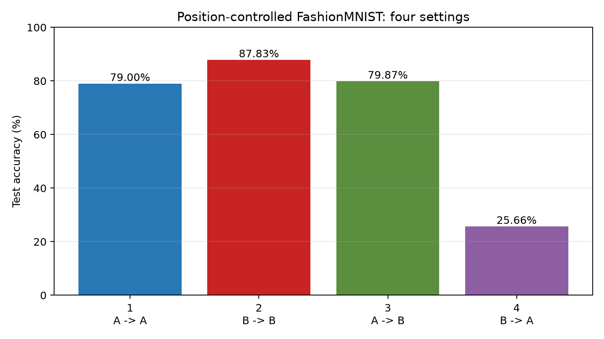
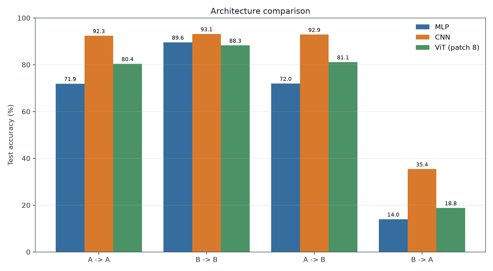
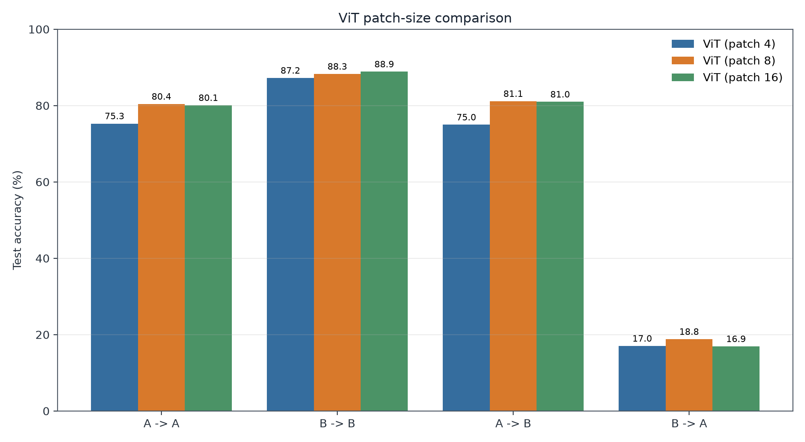
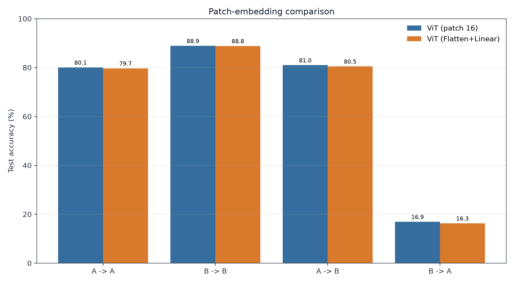

# Results

This directory contains the compact record of the baseline and controlled
comparison experiments.

## Baseline ViT

The original four-setting run uses a patch-size-8 ViT.

| Setting | Train | Test | Accuracy |
|---:|:---:|:---:|---:|
| 1 | A | A | 79.00% |
| 2 | B | B | 87.83% |
| 3 | A | B | 79.87% |
| 4 | B | A | 25.66% |

## Comparison study

| Configuration | Parameters | A -> A | B -> B | A -> B | B -> A |
|---|---:|---:|---:|---:|---:|
| MLP | 542,474 | 71.89 | 89.57 | 71.97 | 13.99 |
| CNN | 205,994 | 92.35 | 93.14 | 92.87 | 35.40 |
| ViT, patch 16 | 829,834 | 80.07 | 88.87 | 80.97 | 16.91 |
| ViT, patch 8 | 811,402 | 80.40 | 88.27 | 81.13 | 18.81 |
| ViT, patch 4 | 829,834 | 75.28 | 87.22 | 74.97 | 17.02 |
| ViT, Flatten + Linear | 829,834 | 79.67 | 88.80 | 80.48 | 16.30 |

The retained result files have distinct roles:

- `metrics.csv` contains all 24 final test measurements.
- `training_history.csv` consolidates the 12 training histories into one table.
- `manifest.json` records the formal protocol and environment.
- `figures/` contains one figure for each comparison group.

Raw checkpoints, duplicate per-run metadata, and duplicate training-curve images
are omitted. They remain available in Git history.

